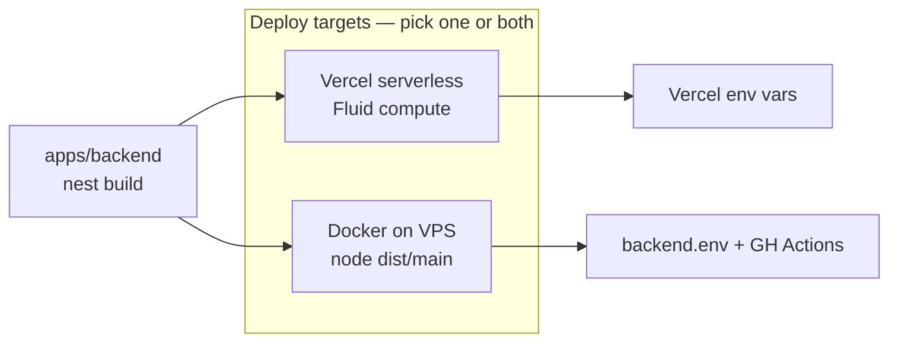

# AmbitiousYou — Backend

NestJS 11 REST API for [AmbitiousYou](https://www.ambitiousyou.pro). PostgreSQL via Drizzle ORM (SQL-first), opaque session auth, and server-derived ambition progress.

## Stack

- **NestJS 11** · **Drizzle ORM** · **PostgreSQL** (`pg`)
- **bcrypt** sessions · **Helmet** · **@nestjs/throttler**
- Transactional email via **Azure Communication Services**
- Schema + domain types from `@ambitiousyou/shared`

## Local development

From the **repo root**:

```bash
pnpm install
pnpm start:backend          # nest start --watch (:3001)
```

Or from this directory:

```bash
cp .env.example .env.local   # then fill DATABASE_URL, etc.
pnpm start:dev
```

### Environment variables

See [`.env.example`](.env.example). Copy to `.env.local` for local dev.

| Variable | Required | Notes |
|---|---|---|
| `DATABASE_URL` | Yes | Local Postgres or Supabase session pooler (`?sslmode=require`) |
| `APP_BASE_URL` | Yes | Frontend origin for links in emails |
| `PORT` | No | Defaults to `3001` |
| `AZURE_CONNECTION_STRING` | No | If unset, outbound email is skipped (logged warning) |

**Deployed environments** inject vars from the platform — not from committed files:

| Target | Where secrets live |
|---|---|
| Local | `apps/backend/.env.local` |
| Vercel | Project **Settings → Environment Variables** |
| VPS / Docker | `/opt/ambitiousyou/<env>/backend.env` (see `infra/`) |

## Commands

```bash
pnpm build              # prebuilds shared, then nest build → dist/
pnpm start:prod         # node dist/main
pnpm test               # Jest unit tests
pnpm lint

pnpm db:generate        # drizzle-kit generate (after schema changes)
pnpm db:migrate         # apply migrations
pnpm db:studio          # browse DB
```

## Deployment

The backend is **platform-agnostic**: the same codebase deploys to **Vercel serverless** (current choice for cost) or a **long-running Docker container on a VPS** (zero-downtime blue-green). No forked config — only where env vars are injected and which entry artifact runs.



### Vercel (serverless)

Used **for the time being** to reduce infra cost. Separate Vercel project, Root Directory **`apps/backend`**.

1. Import the repo (or `vercel link` from `apps/backend`).
2. Set **Environment Variables** for Production / Preview: `DATABASE_URL`, `APP_BASE_URL`, optional `AZURE_CONNECTION_STRING`.
3. [`vercel.json`](vercel.json) runs monorepo install/build (`@ambitiousyou/shared` prebuild).
4. Push or `vercel --prod` to deploy.

`ignoreCommand` in `vercel.json` skips the build when a push only touches other workspaces (same idea as path filters in GitHub Actions).

**Migrations** are not run by Vercel — apply manually before or after deploy:

```bash
cd apps/backend
DATABASE_URL="<target-db>" pnpm exec drizzle-kit migrate
```

**Verify:** `GET /health` → `200` with `{ status: "ok", db: "up" }`.

**Imports on Vercel:** App code uses relative imports (not `src/*` path aliases). Vercel’s Nest builder + NFT only follow relative `require()`s — bare aliases are omitted from the function bundle and crash at boot. Specs may still use `src/` via Jest’s `moduleNameMapper`. Set Function max duration in the Vercel project **Settings → Functions** if needed (`functions` in `vercel.json` only matches `api/` and breaks Nest zero-config).

### VPS + Docker (production pipeline)

Full **zero-downtime** path: GitHub Actions → GHCR → SSH blue-green swap behind nginx. See root [README — Deployment](../../README.md#-deployment--infrastructure) and [`infra/README.md`](../../infra/README.md).

```bash
# Build context is the REPO ROOT
docker build -f apps/backend/Dockerfile -t ambitiousyou-backend .
docker run --env-file backend.env -p 3001:3001 ambitiousyou-backend
```

Runtime: `node dist/main` as non-root user, `HEALTHCHECK` on `/health`, graceful shutdown on `SIGTERM`.

## Project layout

```
src/
├── auth/           SessionGuard, login/register, verify-email, password reset
├── ambitions/      CRUD + ambition-progress.util (atomic recalc in transactions)
├── tasks/ milestones/ notes/ settings/ users/
├── notifications/  Azure email + HTML templates (copied to dist via nest-cli assets)
├── db/             pg.Pool client, Drizzle wiring, migrations
└── main.ts         Nest bootstrap (Vercel Nest entrypoint)
```

## Tests

```bash
pnpm test
pnpm test:e2e
```

Specs use `jest.mock('src/db')` and the auto-mock at `src/db/__mocks__/index.ts`.
