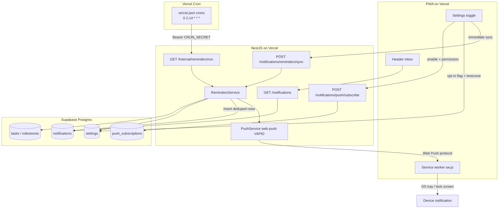
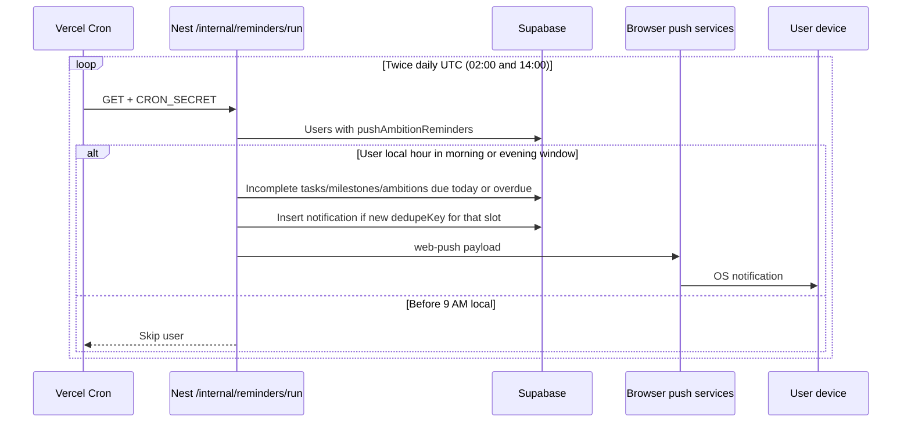
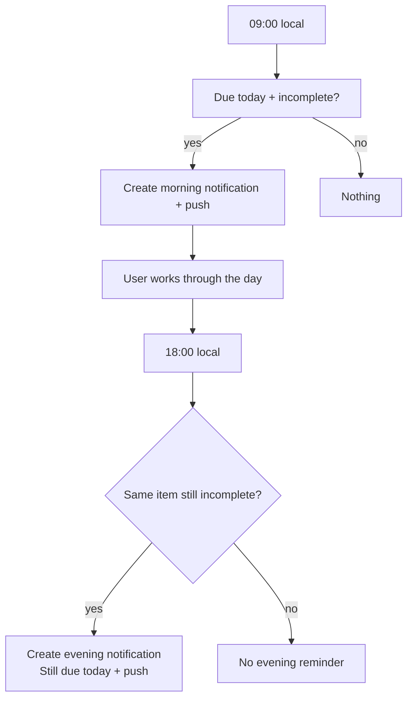

# Ambition reminders (due today)

AmbitiousYou notifies opted-in users about **incomplete tasks, milestones, and ambitions that are due today or overdue**, using each user’s stored timezone.

| Slot | Local window | What happens |
|---|---|---|
| **Morning** | Local hour **≥ 9 and &lt; 18** | Notify open due/overdue moves once (deduped). |
| **Evening** | Local hour **≥ 18** | Notify again only if still open. |

Two daily Vercel Cron ticks (Hobby-compatible) cover global timezones — Nest picks the slot(s) from each user’s local hour, and dedupe keys prevent repeats inside a window.

Delivery channels:

1. **In-app inbox** — bell in the authenticated app header  
2. **On-device OS notification** — Web Push via the PWA (Windows / macOS / Android / iOS Home Screen)

No native apps. Scheduling is **Vercel Cron → Nest on Vercel**. Supabase Cron and GitHub Actions are not used.

---

## How it works (system design)



### Why daily cron ticks, not hourly?

Vercel **Hobby** allows each cron expression to run **at most once per day** (Pro unlocks hourly and sub-daily schedules). Users still need **local** 9 AM / 6 PM windows across timezones.

1. Vercel Cron runs **twice daily UTC** — `0 2 * * *` and `0 14 * * *` in [`vercel.json`](../vercel.json) — hitting most timezones during morning or evening local hours across the two ticks.
2. Nest loads users with `push_ambition_reminders = true`.
3. For each user, Nest reads `user_timezone` and computes the **local hour**.
4. **Morning window** (hour ≥ 9 and &lt; 18) → morning slot only. **Evening window** (hour ≥ 18) → morning catch-up **and** evening slot on the same tick (dedupe prevents duplicates if morning already ran).
5. Queries **incomplete** tasks/milestones/ambitions with due/end date **≤ local today** (includes overdue).

Constants live in `RemindersService.MORNING_HOUR` / `EVENING_HOUR`.

Hour **ranges** plus dedupe keys mean a delayed cron tick still delivers without duplicate sends.

---

## User flows

### Enable reminders


**Manual sync slot (on enable):** before 18:00 local → morning key; at/after 18:00 → evening key. So enabling mid-day still fills the inbox without waiting for the next cron hour.

### Scheduled day (after opt-in)



### Morning vs evening (“took action”)

“Took action” means **completed the task or milestone** — not merely opening or dismissing the notification.



Dedupe keys (unique per user):

- Morning: `task_due_today:{taskId}:{YYYY-MM-DD}:morning`
- Evening: `task_due_today:{taskId}:{YYYY-MM-DD}:evening`
- Same pattern for milestones: `milestone_due_today:…`

Max **two** notifications per item per local day. Completing before 18:00 removes the item from the evening query.

---

## Managing the Vercel Cron schedule

Cron definition: [`apps/backend/vercel.json`](../vercel.json) → `crons` array.

| Trigger | Behavior |
|---|---|
| `schedule: '0 2 * * *'` and `'0 14 * * *'` | Automatic twice-daily UTC ticks (Hobby-compatible) |
| Manual | `curl` with `CRON_SECRET` (see Operations below) |

### Common control actions

| Goal | What to do |
|---|---|
| **Run now** | `curl` the endpoint with `CRON_SECRET` (see Operations) |
| **Change frequency** | Edit the cron expression in `vercel.json` and redeploy |
| **Pause** | Remove the `crons` block from `vercel.json` and redeploy |
| **Delete the cron entirely** | Remove `crons` from `vercel.json` |

Vercel dashboard → Project → **Cron Jobs** shows invocation history and errors.

### Required Vercel env var

Backend Vercel project → **Settings → Environment Variables** (Production scope at minimum):

| Variable | Purpose |
|---|---|
| `CRON_SECRET` | Vercel Cron sends `Authorization: Bearer <CRON_SECRET>` on each invocation |

Generate a strong random string (e.g. `openssl rand -hex 32`). **Without this, cron invocations return 401 and no reminders are sent.**

---

## Platform notes (PWA Web Push)

| Platform | On-device push |
|---|---|
| Windows / macOS / Linux browsers | After notification permission |
| Android Chrome (and similar) | After permission; install optional |
| **iOS / iPadOS 16.4+** | Only after **Add to Home Screen**, open the standalone icon, then allow notifications |

Silent push is not used (`userVisibleOnly: true`). Tapping a notification opens the ambition deep link via `public/sw.js`.

---

## API surface

| Endpoint | Auth | Purpose |
|---|---|---|
| `GET /notifications` | Session | Inbox list + unread count |
| `PATCH /notifications/:id/read` | Session | Mark one read |
| `PATCH /notifications/read-all` | Session | Mark all read |
| `POST /notifications/push/subscribe` | Session | Save Web Push subscription |
| `POST /notifications/push/unsubscribe` | Session | Revoke subscription |
| `POST /notifications/reminders/sync` | Session | Immediate sync for current user/slot |
| `GET /internal/reminders/run` | `Bearer CRON_SECRET` | Scheduled cron sweep (Vercel Cron) |
| `POST /internal/reminders/run` | `Bearer CRON_SECRET` | Manual sweep (curl / debugging) |

---

## Environment variables

### Vercel (backend)

| Variable | Purpose |
|---|---|
| `VAPID_PUBLIC_KEY` | Web Push public key |
| `VAPID_PRIVATE_KEY` | Web Push private key |
| `VAPID_SUBJECT` | e.g. `mailto:support@ambitiousyou.pro` |
| `CRON_SECRET` | Shared secret for `/internal/reminders/run` (required for cron) |

Generate keys: `npx web-push generate-vapid-keys`

### Vercel (frontend)

| Variable | Purpose |
|---|---|
| `NEXT_PUBLIC_VAPID_PUBLIC_KEY` | Same as backend public key (safe to expose) |

---

## Database

Migration: `0005_sticky_spirit.sql`

- `notifications` — inbox rows (`dedupe_key` unique per user)  
- `push_subscriptions` — Web Push endpoints  
- Existing `settings.push_ambition_reminders` + `settings.user_timezone`

Apply: `cd apps/backend && pnpm db:migrate`

---

## Operations

### Manual API test

```bash
curl -X GET "$API_URL/internal/reminders/run" \
  -H "Authorization: Bearer $CRON_SECRET"
```

Example response:

```json
{
  "usersScanned": 12,
  "usersInSlot": 3,
  "notificationsCreated": 5,
  "pushesAttempted": 5,
  "ambitionsMarkedMissed": 2,
  "slot": "cron"
}
```

`usersInSlot` counts users whose **local** hour is currently in the morning or evening window. With twice-daily UTC ticks, many runs still show `0` when no opted-in users are in-window — that is expected.

`ambitionsMarkedMissed` is the count of overdue `active` ambitions flipped to `missed` at the start of the sweep (end date before today, progress &lt; 100%).

### Schedule caveats

- Delivery is tied to **local** 9 / 18 windows, not “9 UTC”.
- Vercel can delay cron invocations by several minutes — slot ranges + dedupe handle this.
- On **Pro**, you can switch back to `0 * * * *` for finer timezone coverage if desired.
- Check Vercel dashboard → Cron Jobs after deploy to confirm invocations succeed.

### Troubleshooting

| Symptom | Check |
|---|---|
| No OS notification | Permission? VAPID on Vercel backend + frontend? `/sw.js` registered? |
| iOS silent | Opened from Home Screen icon (standalone)? |
| Cron 401 | `CRON_SECRET` set on backend Vercel project (Production) |
| Cron never runs | `crons` in `vercel.json` deployed? Vercel plan supports cron? |
| `usersInSlot: 0` | No opted-in users currently in morning/evening local window |
| Evening empty | Item already completed, or evening dedupe already inserted |
| Inbox empty after enable | Migration applied? Opt-in true? Due dates today in user TZ? |

---

## Code map

| Area | Path |
|---|---|
| Schema | `apps/backend/src/db/schema/notifications.ts`, `push-subscriptions.ts` |
| Sweep + 9/18 slots | `apps/backend/src/notifications/reminders.service.ts` |
| Push send | `apps/backend/src/notifications/push.service.ts` |
| HTTP | `apps/backend/src/notifications/notifications.controller.ts`, `reminders.controller.ts` |
| Service worker | `apps/frontend/public/sw.js` |
| Settings UX | `apps/frontend/src/components/(app)/settings/notifications-settings-tab.tsx` |
| Inbox UI | `apps/frontend/src/components/(app)/notifications/notifications-inbox.tsx` |
| Cron config | `apps/backend/vercel.json` |
