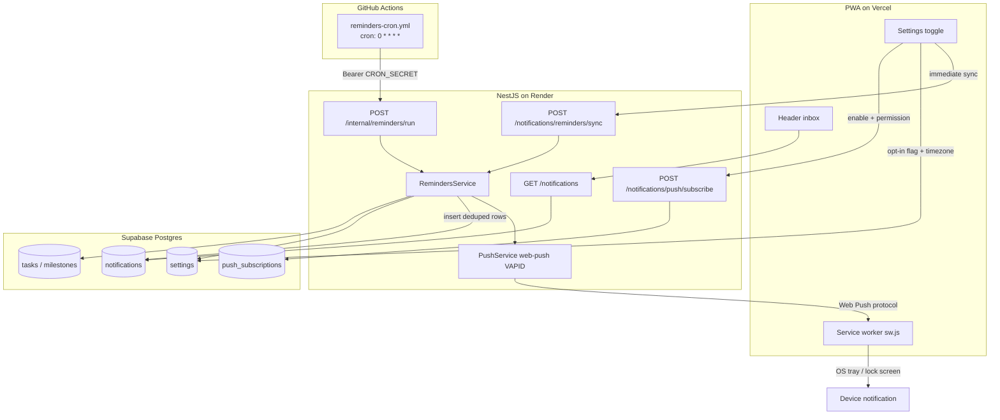
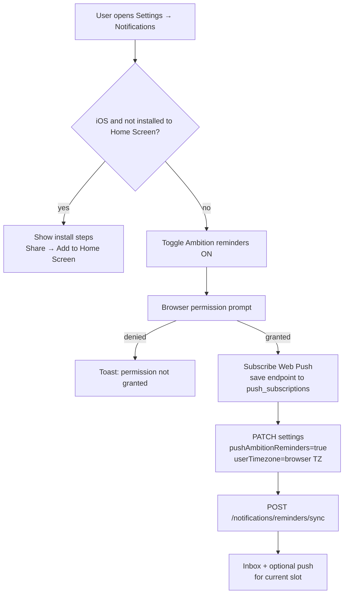
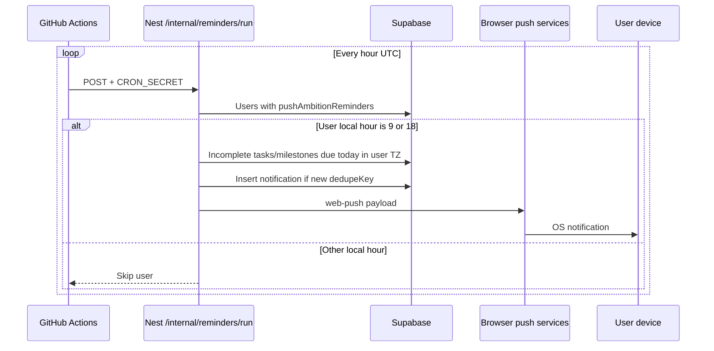
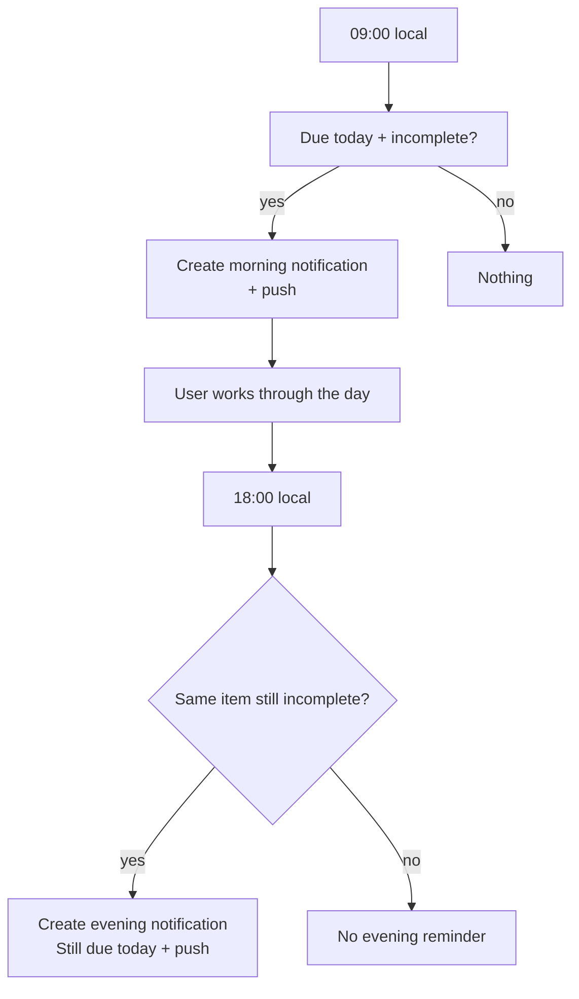

# Ambition reminders (due today)

AmbitiousYou notifies users about **incomplete tasks and milestones due today**, twice per local day:

| Slot | Local time | When it fires |
|---|---|---|
| **Morning** | **09:00** | Every incomplete task/milestone due today |
| **Evening** | **18:00** | Same items **only if still incomplete** (user did not finish them after the morning ping) |

Delivery channels:

1. **In-app inbox** — bell in the authenticated app header  
2. **On-device OS notification** — Web Push via the installed PWA (Windows / macOS / Android / iOS Home Screen)

No native apps. No Supabase Cron. Scheduling is **GitHub Actions** → Nest on Render.

---

## How it works (system design)



### Why hourly Actions, not “two crons at 9 and 6”?

Users live in many timezones. A single UTC clock cannot be “9 AM for everyone.”

GitHub Actions runs **every hour UTC**. Nest loads opted-in users, reads `settings.user_timezone`, and only acts when that user’s **local hour is 9 or 18**. Everyone gets morning/evening in *their* timezone without per-user cron jobs.

---

## User flows

### Enable reminders



### Scheduled day (after opt-in)



### Morning vs evening (“took action”)

“Took action” means **completed the task or milestone** (not merely opening the notification).



Dedupe keys (per user):

- Morning: `task_due_today:{taskId}:{YYYY-MM-DD}:morning`
- Evening: `task_due_today:{taskId}:{YYYY-MM-DD}:evening`

(and the same pattern for milestones)

So the same item can notify **at most twice per local day**. Completing it before 18:00 drops it out of the evening query.

---

## Platform notes (PWA Web Push)

| Platform | On-device push |
|---|---|
| Windows / macOS / Linux browsers | After notification permission |
| Android Chrome (and similar) | After permission; install optional |
| **iOS / iPadOS 16.4+** | Only after **Add to Home Screen**, open the standalone icon, then allow notifications |

Silent push is not used (`userVisibleOnly: true`). Tapping a notification opens the ambition deep link.

---

## API surface

| Endpoint | Auth | Purpose |
|---|---|---|
| `GET /notifications` | Session | Inbox list + unread count |
| `PATCH /notifications/:id/read` | Session | Mark one read |
| `PATCH /notifications/read-all` | Session | Mark all read |
| `POST /notifications/push/subscribe` | Session | Save Web Push subscription |
| `POST /notifications/push/unsubscribe` | Session | Revoke subscription |
| `POST /notifications/reminders/sync` | Session | Immediate sync for current user/slot |
| `POST /internal/reminders/run` | `Bearer CRON_SECRET` | Hourly cron sweep |

---

## Environment variables

### Render (backend)

| Variable | Purpose |
|---|---|
| `VAPID_PUBLIC_KEY` | Web Push public key |
| `VAPID_PRIVATE_KEY` | Web Push private key |
| `VAPID_SUBJECT` | e.g. `mailto:support@ambitiousyou.pro` |
| `CRON_SECRET` | Shared secret for `/internal/reminders/run` |

Generate keys: `npx web-push generate-vapid-keys`

### Vercel (frontend)

| Variable | Purpose |
|---|---|
| `NEXT_PUBLIC_VAPID_PUBLIC_KEY` | Same as backend public key (safe to expose) |

### GitHub Actions (`production-backend` environment)

| Secret | Purpose |
|---|---|
| `REMINDERS_API_URL` | Render API base, e.g. `https://api.ambitiousyou.pro` |
| `CRON_SECRET` | Same value as Render `CRON_SECRET` |

Workflow: [`.github/workflows/reminders-cron.yml`](../../../.github/workflows/reminders-cron.yml)

---

## Database

Migration: `0005_sticky_spirit.sql`

- `notifications` — inbox rows (`dedupe_key` unique per user)  
- `push_subscriptions` — Web Push endpoints  
- Existing `settings.push_ambition_reminders` + `settings.user_timezone`

Apply: `cd apps/backend && pnpm db:migrate`

---

## Operations

### Manual cron test

```bash
curl -X POST "$API_URL/internal/reminders/run" \
  -H "Authorization: Bearer $CRON_SECRET" \
  -H "Content-Type: application/json" \
  -d '{}'
```

Example response:

```json
{
  "usersScanned": 12,
  "usersInSlot": 3,
  "notificationsCreated": 5,
  "pushesAttempted": 5,
  "slot": "cron"
}
```

Or run **Actions → reminders-cron → Run workflow**.

### GitHub schedule caveats

- `0 * * * *` is hourly UTC; delivery is when Nest sees local hour 9 or 18.
- GitHub can delay scheduled workflows by several minutes under load — acceptable for day-level reminders.
- Repo must be active (GitHub may disable schedules on stale public repos); use `workflow_dispatch` to verify.

### Troubleshooting

| Symptom | Check |
|---|---|
| No OS notification | Permission granted? VAPID set on Render + Vercel? SW registered (`/sw.js`)? |
| iOS silent | App opened from Home Screen icon (standalone)? |
| Cron 401 | `CRON_SECRET` matches Render and GitHub environment secret |
| Cron 0 created at 9 UTC | User timezone — local hour may not be 9 yet |
| Evening always empty | Items completed already, or morning dedupe only — evening uses `:evening` key |
| Inbox empty after enable | Migration applied? `pushAmbitionReminders` true? Due dates today in user TZ? |

---

## Code map

| Area | Path |
|---|---|
| Schema | `packages/shared/db/schema/notifications.ts`, `push-subscriptions.ts` |
| Sweep + slots | `apps/backend/src/notifications/reminders.service.ts` |
| Push send | `apps/backend/src/notifications/push.service.ts` |
| HTTP | `apps/backend/src/notifications/notifications.controller.ts`, `reminders.controller.ts` |
| Service worker | `apps/frontend/public/sw.js` |
| Settings UX | `apps/frontend/src/components/(app)/settings/notifications-settings-tab.tsx` |
| Inbox UI | `apps/frontend/src/components/(app)/notifications/notifications-inbox.tsx` |
| Cron workflow | `.github/workflows/reminders-cron.yml` |
