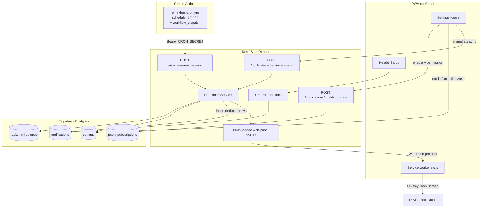
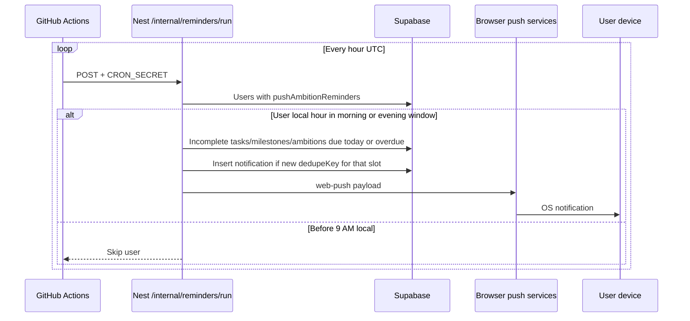
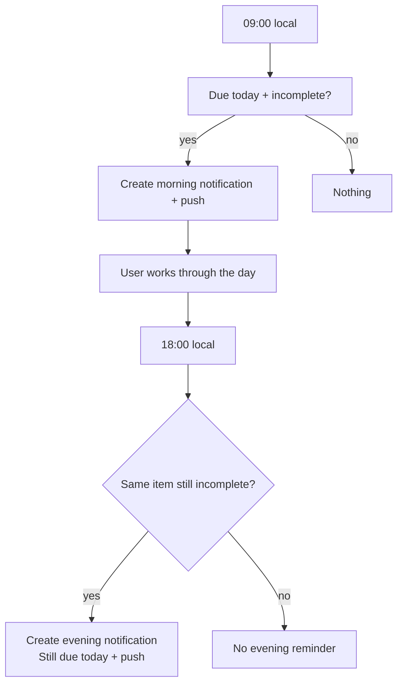

# Ambition reminders (due today)

AmbitiousYou notifies opted-in users about **incomplete tasks, milestones, and ambitions that are due today or overdue**, using each user’s stored timezone.

| Slot | Local window | What happens |
|---|---|---|
| **Morning** | Local hour **≥ 9 and &lt; 18** | Notify open due/overdue moves once (deduped). |
| **Evening** | Local hour **≥ 18** | Notify again only if still open. |

Hourly GitHub Actions ticks are enough — Nest picks the slot from the user’s local hour, and dedupe keys prevent repeats inside the window.

Delivery channels:

1. **In-app inbox** — bell in the authenticated app header  
2. **On-device OS notification** — Web Push via the PWA (Windows / macOS / Android / iOS Home Screen)

No native apps. Scheduling is **GitHub Actions → Nest on Render**. Supabase Cron is not used.

---

## How it works (system design)



### Why hourly Actions, not two fixed UTC crons?

Users live in many timezones. “9 AM” and “6 PM” must be **local**.

1. GitHub Actions runs **every hour UTC** (`0 * * * *`).
2. Nest loads users with `push_ambition_reminders = true`.
3. For each user, Nest reads `user_timezone` and computes the **local hour**.
4. **Morning window** (hour ≥ 9 and &lt; 18) or **evening window** (hour ≥ 18) creates/sends once per slot (deduped).
5. Queries **incomplete** tasks/milestones/ambitions with due/end date **≤ local today** (includes overdue).

Constants live in `RemindersService.MORNING_HOUR` / `EVENING_HOUR`.

---

## User flows

### Enable reminders


**Manual sync slot (on enable):** before 18:00 local → morning key; at/after 18:00 → evening key. So enabling mid-day still fills the inbox without waiting for the next cron hour.

### Scheduled day (after opt-in)



### Morning vs evening (“took action”)

“Took action” means **completed the task or milestone** — not merely opening or dismissing the notification.



Dedupe keys (unique per user):

- Morning: `task_due_today:{taskId}:{YYYY-MM-DD}:morning`
- Evening: `task_due_today:{taskId}:{YYYY-MM-DD}:evening`
- Same pattern for milestones: `milestone_due_today:…`

Max **two** notifications per item per local day. Completing before 18:00 removes the item from the evening query.

---

## Managing the GitHub Actions cron

Workflow file: [`.github/workflows/reminders-cron.yml`](../../../.github/workflows/reminders-cron.yml)

Triggers today:

| Trigger | Behavior |
|---|---|
| `schedule: '0 * * * *'` | Automatic hourly UTC tick |
| `workflow_dispatch` | Manual **Run workflow** from the Actions UI |

### Common control actions

| Goal | What to do |
|---|---|
| **Run now** | GitHub → Actions → **reminders-cron** → **Run workflow** |
| **Manual-only (stop automatic)** | Edit the workflow: remove the `schedule:` block; keep only `workflow_dispatch` |
| **Change frequency** | Edit the cron expression in the YAML and push |
| **Pause without deleting file** | Remove or rotate `CRON_SECRET` / `REMINDERS_API_URL` so the job fails closed; or comment out `schedule` |
| **Delete the cron entirely** | Delete `.github/workflows/reminders-cron.yml` and push |
| **Disable all Actions** | Repo Settings → Actions → disable (affects every workflow) |

There is no separate “cron dashboard” — **the workflow YAML is the schedule**. Change the file = change the job.

### Required GitHub secrets

Environment: **`production-backend`**

| Secret | Purpose |
|---|---|
| `REMINDERS_API_URL` | Render API base, e.g. `https://api.ambitiousyou.pro` |
| `CRON_SECRET` | Same value as Render `CRON_SECRET` |

---

## Platform notes (PWA Web Push)

| Platform | On-device push |
|---|---|
| Windows / macOS / Linux browsers | After notification permission |
| Android Chrome (and similar) | After permission; install optional |
| **iOS / iPadOS 16.4+** | Only after **Add to Home Screen**, open the standalone icon, then allow notifications |

Silent push is not used (`userVisibleOnly: true`). Tapping a notification opens the ambition deep link via `public/sw.js`.

---

## API surface

| Endpoint | Auth | Purpose |
|---|---|---|
| `GET /notifications` | Session | Inbox list + unread count |
| `PATCH /notifications/:id/read` | Session | Mark one read |
| `PATCH /notifications/read-all` | Session | Mark all read |
| `POST /notifications/push/subscribe` | Session | Save Web Push subscription |
| `POST /notifications/push/unsubscribe` | Session | Revoke subscription |
| `POST /notifications/reminders/sync` | Session | Immediate sync for current user/slot |
| `POST /internal/reminders/run` | `Bearer CRON_SECRET` | Hourly cron sweep |

---

## Environment variables

### Render (backend)

| Variable | Purpose |
|---|---|
| `VAPID_PUBLIC_KEY` | Web Push public key |
| `VAPID_PRIVATE_KEY` | Web Push private key |
| `VAPID_SUBJECT` | e.g. `mailto:support@ambitiousyou.pro` |
| `CRON_SECRET` | Shared secret for `/internal/reminders/run` |

Generate keys: `npx web-push generate-vapid-keys`

### Vercel (frontend)

| Variable | Purpose |
|---|---|
| `NEXT_PUBLIC_VAPID_PUBLIC_KEY` | Same as backend public key (safe to expose) |

---

## Database

Migration: `0005_sticky_spirit.sql`

- `notifications` — inbox rows (`dedupe_key` unique per user)  
- `push_subscriptions` — Web Push endpoints  
- Existing `settings.push_ambition_reminders` + `settings.user_timezone`

Apply: `cd apps/backend && pnpm db:migrate`

---

## Operations

### Manual API test

```bash
curl -X POST "$API_URL/internal/reminders/run" \
  -H "Authorization: Bearer $CRON_SECRET" \
  -H "Content-Type: application/json" \
  -d '{}'
```

Example response:

```json
{
  "usersScanned": 12,
  "usersInSlot": 3,
  "notificationsCreated": 5,
  "pushesAttempted": 5,
  "ambitionsMarkedMissed": 2,
  "slot": "cron"
}
```

`usersInSlot` counts users whose **local** hour is currently 9 or 18. At other UTC hours this is often `0` even when many users are opted in — that is expected.

`ambitionsMarkedMissed` is the count of overdue `active` ambitions flipped to `missed` at the start of the sweep (end date before today, progress &lt; 100%).

### Schedule caveats

- Delivery is tied to **local** 9 / 18, not “9 UTC”.
- GitHub can delay scheduled workflows by several minutes — fine for day-level reminders.
- Use **Run workflow** to verify secrets after deploy.

### Troubleshooting

| Symptom | Check |
|---|---|
| No OS notification | Permission? VAPID on Render + Vercel? `/sw.js` registered? |
| iOS silent | Opened from Home Screen icon (standalone)? |
| Cron 401 | `CRON_SECRET` matches Render and GitHub `production-backend` |
| Cron `usersInSlot: 0` | Not currently 9 or 18 in any opted-in user’s timezone |
| Evening empty | Item already completed, or evening dedupe already inserted |
| Inbox empty after enable | Migration applied? Opt-in true? Due dates today in user TZ? |

---

## Code map

| Area | Path |
|---|---|
| Schema | `packages/shared/db/schema/notifications.ts`, `push-subscriptions.ts` |
| Sweep + 9/18 slots | `apps/backend/src/notifications/reminders.service.ts` |
| Push send | `apps/backend/src/notifications/push.service.ts` |
| HTTP | `apps/backend/src/notifications/notifications.controller.ts`, `reminders.controller.ts` |
| Service worker | `apps/frontend/public/sw.js` |
| Settings UX | `apps/frontend/src/components/(app)/settings/notifications-settings-tab.tsx` |
| Inbox UI | `apps/frontend/src/components/(app)/notifications/notifications-inbox.tsx` |
| Cron workflow | `.github/workflows/reminders-cron.yml` |
