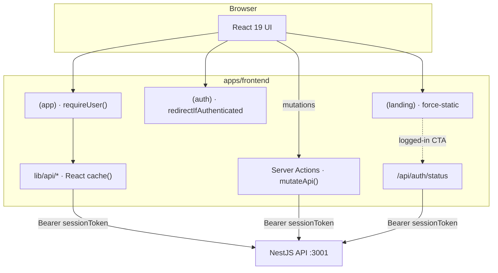

# AmbitiousYou — Frontend

Next.js 16 App Router UI for [AmbitiousYou](https://www.ambitiousyou.pro) — the product surface where people declare ambitions, track moves (tasks + milestones), and watch server-derived progress stay honest.

Server Components by default, typed Server Actions for mutations, and a statically rendered marketing site that still knows when you're logged in.

## Stack

- **Next.js 16** (App Router) · **React 19** · **React Compiler** · **Turbopack**
- **TypeScript 5** · **Tailwind CSS v4** · **shadcn/ui** (Radix)
- **next-themes** · **sonner** · **Recharts** · **dnd-kit** · **TanStack Table**
- Domain types from `@/types` (hand-written API contract types)
- **Vitest** + Testing Library for unit/component tests

## What this app does

| Surface | Routes | Role |
|---|---|---|
| **Marketing** | `/`, `/features`, `/experience`, `/pricing`, `/templates`, `/use-cases`, `/compare`, … | `force-static` SEO pages — canonical URLs, JSON-LD, sitemap/robots/manifest |
| **Auth** | `/login`, `/signup`, `/verify-email`, `/forgot-password`, `/reset-password` | Session cookie flows; bounce signed-in visitors to the dashboard |
| **Product** | `/dashboard`, `/ambitions`, `/ambitions/[id]`, `/settings` | Gated by `requireUser()` — ambitions, moves, notes, notifications, settings |

The browser never talks to the Nest API directly. RSC reads and Server Actions call `API_URL` server-side with a Bearer session token, so there's no CORS attack surface and secrets stay off the client.

## Architecture



### Auth gates (`src/lib/auth.ts`)

Three functions with distinct contracts — use the right one:

| Function | When to use |
|---|---|
| `requireUser()` | Mandatory gate for `(app)` pages. Validates the cookie against the backend; redirects to `/login` on missing/forged/expired. Wrapped in React `cache()` so layout + page share one call. |
| `getSessionToken()` | Raw cookie for a downstream backend call that itself enforces `SessionGuard`. Never use this to gate a render. |
| `redirectIfAuthenticated()` | Bounce signed-in visitors away from `(auth)` pages. |

Marketing pages stay static via a readable `ay_auth` hint cookie for the optimistic CTA, then `/api/auth/status` confirms the session and **clears stale cookies** when the backend rejects them.

### Data layer

- **Reads** — `src/lib/api/<resource>/` — server `fetch` with `Authorization: Bearer`. Prefer composite endpoints (`getAmbitionFull`, `getAmbitionMovesBatch`) over N×per-resource calls. Wrap hot helpers in React `cache()`.
- **Writes** — `src/lib/actions/` — `"use server"` mutations via `mutateApi()`, then scoped `revalidateAmbition(id, scopes)` (`detail` \| `list` \| `dashboard`).
- **Client sync** — optimistic local state reconciles from the action response; no SWR/React Query.

### UI conventions

Server Components by default; `"use client"` only for interactive islands. Supporting components colocate under `src/components/(app)/…` mirroring the route. Full interaction/a11y/performance rules live in [`AGENTS.md`](./AGENTS.md).

## Local development

From the **repo root** (backend must be running):

```bash
pnpm install
pnpm start:backend          # NestJS on :3001
pnpm start:frontend         # Next.js on :3000
```

Or from this directory:

```bash
cp .env.example .env.local  # then fill API_URL, etc.
pnpm dev
```

Open [http://localhost:3000](http://localhost:3000).

### Environment variables

See [`.env.example`](.env.example). Copy to `.env.local` for local dev.

| Variable | Required | Notes |
|---|---|---|
| `API_URL` | Yes | Backend origin (server-only). Local: `http://localhost:3001` |
| `NEXT_PUBLIC_SITE_URL` | No | Canonical origin for SEO/OG/sitemap. Defaults to `https://www.ambitiousyou.pro` |
| `NEXT_PUBLIC_VAPID_PUBLIC_KEY` | No | Web Push public key; must match backend `VAPID_PUBLIC_KEY` |
| `CSP_REPORT_ONLY` | No | Set `1` on a preview to roll out CSP without enforcing |

**Deployed environments** inject vars from Vercel — never commit secrets.

| Target | Where secrets live |
|---|---|
| Local | `apps/frontend/.env.local` |
| Vercel | Project **Settings → Environment Variables** |

## Commands

```bash
pnpm dev                # next dev (Turbopack)
pnpm build              # prebuilds shared + icons, then next build
pnpm start              # next start (production)
pnpm lint               # eslint
pnpm test               # vitest run
pnpm test:watch         # vitest watch
pnpm generate:icons     # regenerate PWA/icon assets
```

From the repo root you can also use `pnpm --filter frontend <script>` / `pnpm start:frontend`.

## Project layout

```
src/
├── app/
│   ├── (landing)/      # Marketing — force-static SEO pages
│   ├── (auth)/         # Login, signup, verify, password recovery
│   ├── (app)/          # Dashboard, ambitions, settings (requireUser)
│   ├── api/auth/status # Dynamic session check + stale-cookie heal
│   ├── sitemap.ts · robots.ts · manifest.ts · opengraph-image.tsx
│   └── llms.txt/       # LLM-facing site summary
├── components/
│   ├── (landing)/ (auth)/ (app)/   # Route-colocated UI
│   ├── ui/                         # shadcn primitives
│   └── seo/                        # JSON-LD helpers
├── lib/
│   ├── api/            # Server-side reads
│   ├── actions/        # Server Actions (auth + app mutations)
│   ├── (app)/mutations/# Optimistic UI primitives
│   ├── auth.ts         # requireUser / getSessionToken / redirectIfAuthenticated
│   ├── seo/ · site.ts · brand.ts
│   └── dashboard/      # Aggregations for the dashboard
├── hooks/
└── styles/
```

## Deployment

Hosted on **Vercel**. Root Directory `apps/frontend`. Deploys are triggered only by [`.github/workflows/deploy-frontend-and-backend-to-vercel.yml`](../../.github/workflows/deploy-frontend-and-backend-to-vercel.yml) (after backend deploy on the same push). Git auto-deploy is disabled in [`vercel.json`](vercel.json). Apex `ambitiousyou.pro` permanently redirects to `www`.

| Environment | Branch | URL |
|---|---|---|
| Production | `main` | https://www.ambitiousyou.pro |
| Development | `dev` | https://dev.ambitiousyou.pro |

Set at least `API_URL` and `NEXT_PUBLIC_SITE_URL` per environment in the Vercel dashboard. CSP, HSTS, and related headers are configured in [`next.config.ts`](next.config.ts).

## Tests

```bash
pnpm test
pnpm test:watch
```

Vitest covers dashboard aggregations, form parsers, optimistic/tracked-item helpers, and a few critical forms/editors. There is no Playwright e2e suite in this package yet.

## Related docs

- Root [README](../../README.md) — product overview, monorepo architecture, CI/CD
- Backend [README](../backend/README.md) — NestJS API, Drizzle, sessions
- [`AGENTS.md`](./AGENTS.md) — UI/UX MUST/SHOULD/NEVER rules for this app
)
