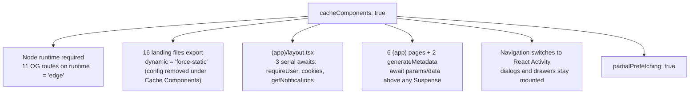

# Cache Components Migration Plan

A scoped, honest assessment of what it would take to adopt **Cache Components**
(`cacheComponents: true`) and **Partial Prefetching** (`partialPrefetching: true`) in
`apps/frontend`. Written against **Next.js 16.3**, which is what the app runs today.

> **Status: deferred, not rejected.** The 16.3 upgrade itself is done — the frontend already
> has the free wins (dev memory, build cache, faster SSR, prefetch bundling, `retry()` error
> boundaries). This document exists so the decision to adopt the *opt-in* half of 16.3 is made
> with the real cost on the table rather than from the release-notes summary.

## Why this is one decision, not two

Partial Prefetching is the feature we actually want — it gives every `<Link>` a shared **App
Shell** per route instead of a per-link prefetch, which means fewer and lighter prefetch
payloads (a Hobby-tier cost lever) plus SPA-feeling navigation on the hot paths.

It cannot be adopted alone. From the [adoption guide](https://nextjs.org/docs/app/guides/adopting-partial-prefetching):

> Partial Prefetching only works when `cacheComponents` is enabled.

The incremental escape hatch — `export const prefetch = 'partial'` per route — still requires
the global `cacheComponents` flag to be on. So the entry price is the full Cache Components
migration; Partial Prefetching is then a follow-on flag.

## What `cacheComponents: true` demands of *this* app



### 1. Node runtime — already done

Cache Components requires the Node.js runtime and rejects `runtime = 'edge'`. The eleven OG
image routes that set it (nine under `(landing)/*/opengraph-image.tsx` plus
`src/app/opengraph-image.tsx` and `src/app/twitter-image.tsx`) were migrated during the 16.3
upgrade, since `runtime = 'edge'` is deprecated in 16.3 regardless. **This prerequisite is
already satisfied.**

### 2. The landing surface loses `dynamic = 'force-static'`

Sixteen files under `(landing)` export `dynamic = "force-static"` — the group layout plus every
page. Under Cache Components the `dynamic`, `revalidate`, `fetchCache`, and `dynamicParams`
route segment configs are **removed** (Next.js 16.0 change).

This is the single most sensitive part of the migration, because
`apps/frontend/AGENTS.md` names static landing pages as an explicit serverless-cost lever.
The pages read no dynamic APIs, so they *should* still prerender under the new model without
the export — but "should" needs to be verified route by route against `next build` output
before this ships. The three `generateStaticParams` routes (`/templates/[slug]`,
`/use-cases/[slug]`, `/compare/[competitor]`) also change behavior: unprerendered params now
serve an instant App Shell and upgrade in the background
([ISR with Cache Components](https://nextjs.org/docs/app/guides/incremental-static-regeneration-cache-components)).

### 3. `(app)/layout.tsx` is the real work

```tsx
export default async function AppLayout({ children }) {
  const { user: userDetails, sessionToken } = await requireUser();
  const cookieStore = await cookies();
  const defaultOpen = parseSidebarOpen(cookieStore.get(SIDEBAR_STORAGE_KEY)?.value);
  const inbox = await getNotifications(sessionToken, 20);
```

Three **serial** awaits at the top of the layout gate every authenticated route. Under Cache
Components each uncached data access outside a `<Suspense>` boundary is a prerender error.

The good news is that `cookies()` and `headers()` do **not** tie content to a URL — they vary
per session, and [session data resolves in the App Shell](https://nextjs.org/docs/app/guides/runtime-prefetching#session-data-resolves-in-the-shell).
The canonical fix is to read the session value outside a cached function and pass it in:

```tsx
async function getInbox(sessionToken: string) {
  "use cache";
  return getNotifications(sessionToken, 20);
}
```

The `requireUser()` gate needs more care than a mechanical wrap: it calls `redirect()` on an
invalid session, and a `redirect()` inside a `use cache` scope would cache the redirect. The
session validation must stay uncached (or be cached strictly behind the token value) while the
*user profile render* is what gets cached.

### 4. Pages await above any boundary

Six `(app)` pages plus two `generateMetadata` functions await `requireUser()`, `params`, and
`searchParams` at the top level. Each needs the URL-independent shell hoisted out and the
`params`/`searchParams` read pushed into a `<Suspense>`-wrapped child that awaits the promise
itself — the pattern in
[Auditing routes for URL data](https://nextjs.org/docs/app/guides/adopting-partial-prefetching#auditing-routes-for-url-data).

`/ambitions/[ambitionId]` is the interesting one: `generateMetadata` and the page both await
the same `cache()`-wrapped `getAmbitionFull`, and a `params` read inside `generateMetadata`
surfaces its own separate insight.

The four existing `loading.tsx` shells (`dashboard`, `ambitions`, `ambitions/[ambitionId]`,
`settings`) largely become redundant — Cache Components extracts finer-grained shells from
inline Suspense boundaries, which is strictly better than a whole-route skeleton. Expect to
convert them rather than keep them.

### 5. Navigation switches to React `Activity` — the behavioral risk

This is the item most likely to cause a user-visible regression, and it has nothing to do with
caching. With `cacheComponents` on, Next.js stops unmounting the previous route on client
navigation and sets it to `Activity` mode `"hidden"`. State is preserved, effects are torn down
and recreated on re-show.

This app is dialog- and drawer-heavy: `move-detail-dialog`, `note-detail-dialog`,
`enable-reminders-dialog`, `confirm-task-reopen`, the vaul drawers, and the optimistic-list
primitives in `src/lib/(app)/mutations/`. Every one needs a pass against the
[Preserving UI state guide](https://nextjs.org/docs/app/guides/preserving-ui-state).

## Suggested sequencing

Do this on a branch, not incrementally on `dev` — the flag is global and the intermediate
states are not shippable.

1. Turn on `cacheComponents: true`, run `next dev`, and collect the blocking-prerender errors.
   Each one prints a labeled fix menu (`stream` / `cache` / `block`) in both the overlay and the
   terminal.
2. Opt every not-yet-ready route out with `export const instant = false` so the app runs, then
   remove them one at a time.
3. Fix `(app)/layout.tsx` first — it gates every authenticated route, so nothing below it can
   be evaluated until it prerenders.
4. Verify the landing surface still prerenders in `next build` output before touching anything
   else in `(landing)`.
5. Audit dialogs and drawers under `Activity`.
6. Only then enable `partialPrefetching: true` and audit the ~30 `prefetch={true}` call sites
   against the [decision table](https://nextjs.org/docs/app/guides/adopting-partial-prefetching#auditing-link-prefetchtrue-calls) —
   most become redundant and should be removed.
7. Add e2e coverage with the `instant()` Playwright helper to lock in the hot paths. This
   package has no e2e suite today, so that is net-new setup.

Vercel ships first-party skills for steps 1–2 (`next-cache-components-adoption`) and step 6
(`next-partial-prefetching-adoption`) that drive this with a coding agent and check in at each
feature boundary.

## Deferred experiments (unrelated to the above)

Both shipped as experimental in 16.3 and were deliberately skipped during the upgrade:

| Flag | What it buys | Why not yet |
|---|---|---|
| `experimental.turbopackRustReactCompiler` | Runs the React Compiler in Turbopack instead of Babel — ~34% faster cold `next dev`, ~46% warm. This app already has `reactCompiler: true`. | Experimental, and it changes **production** build output. A dev-speed win is not worth a compiled-output risk on a live app. Revisit once stable. |
| `experimental.useOffline` | Keeps soft navigations, fetches, and Server Actions pending across a network drop and retries on reconnect; adds a `useOffline()` hook for an offline banner. | Genuinely well-matched to this app's optimistic-mutation model, but experimental. Also pairs best with Partial Prefetching, since a prefetched shell is what renders while offline — so it belongs *after* this migration, not before. |

## Also considered and ruled out

Not deferrals — these do not apply to this codebase at all:

- **Root params** (`next/root-params`) — no dynamic segment exists above the root layout. All
  five `[param]` segments sit two levels down inside route groups. There is no `[lang]`.
- **`import.meta.glob`** — SEO and marketing content lives in TypeScript modules under
  `src/lib/seo/` and `src/lib/marketing/`, not as files read from disk.
- **TypeScript 7** — `next build` already runs the project-local `tsc` CLI by default in 16.3,
  so the bump is available whenever wanted. Held back because typescript-eslint has no official
  TS 7 support yet, and the frontend lint step is a CI gate.
